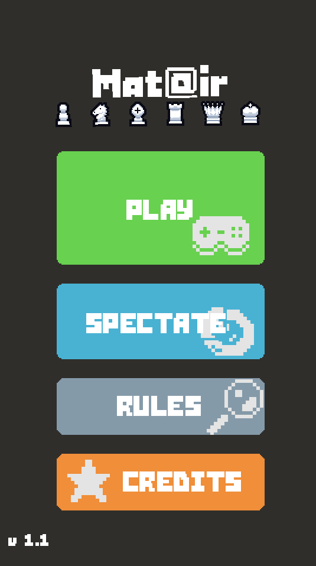

# Mat@ir Game
<!-- Badges Section -->
<p align="left">
  <a href="https://gamemaker.io" target="_blank">
    
  </a>
  
</p>
An online multiplayer game developed with GameMaker for the Mat@ir project.

<picture>
  
</picture>


Learn more about the Mat@ir project here: [HACKADAY PAGE](https://hackaday.io/project/202508-matir)

## Exporting the Game (for Web/HTML5 Deployment)

This guide will walk you through exporting the game to an HTML5 format suitable for web deployment.

### Prerequisites

1.  **GameMaker:** Download and install the latest version of GameMaker from [here](https://gamemaker.io/download).
2.  **Repository:** Clone or download this repository to your local machine.

### Export Steps

1.  **Open Project:** Launch GameMaker and open the project file: `Spherical chess.yyp`.
2.  **Select HTML5 Export Target:**
    *   In the top-right corner of the GameMaker IDE, select `HTML5` as the export target.
    *   If you haven't used it before, GameMaker may prompt you to download the HTML5 module. Proceed with the download and installation.
    

3.  **Export Project:**
    *   Click the "Export Project" button.
    *   Choose a dedicated directory for the exported files.
    
    After a successful export, your chosen directory should contain an `index.html` file and an `html5game` subdirectory, among other files. It should look similar to this:
    

4.  **Relocate PWA Files:**
    For Progressive Web App (PWA) functionality, you need to move specific files from the `html5game` subdirectory to the main export directory (the one containing `index.html`).
    *   The files to move are:
        *   `manifest.json`
        *   `serviceWorker.js`
        *   `icon512_rounded.png`
        *   `icon512_maskable.png`
    
    After moving these files, your main export directory should look like this:
    

5.  **Configure Server Connection:**
    *   Navigate into the `html5game` subdirectory.
    *   Open the `config.ini` file with a text editor.
    *   Modify the `server_ip` and `server_port` values to match the IP address and port of the machine hosting your Mat@ir game server (the machine running the [Python backend script](https://github.com/Nasser404/matair-server)).

> [!NOTE]
> If you are testing the exported game locally and running the [Python server script](https://github.com/Nasser404/matair-server) on the *same machine*, you can often keep the default `config.ini` settings (e.g., `server_ip = "127.0.0.1"`).

6.  **Deploy to Server:**
    Upload the entire contents of your main export directory (including `index.html`, the modified `html5game` subdirectory, and the relocated PWA files) to a directory on your web server.

## Local Testing and Development

> [!WARNING]
> For general development and quick local testing, it is **recommended to run the game directly from the GameMaker IDE** (by pressing the "Play" button or F5).

If you specifically want to test the *exported HTML5 build* locally:
1.  Follow all the "Exporting the Game" steps above.
2.  Ensure the `config.ini` (inside the `html5game` folder) is pointing to your local server instance (e.g., `127.0.0.1`).
3.  Make sure the [Mat@ir Python server](https://github.com/Nasser404/matair-server) is running on your machine.
4.  You will need to serve the game files using a local web server. Simply opening the `index.html` file directly in your browser (e.g., `file:///.../index.html`) will likely **not work** due to browser security restrictions (CORS issues) for web applications.
    *   One simple way is to use Python's built-in HTTP server. Open a terminal or command prompt in your main export directory (where `index.html` is located) and run:
        ```bash
        python -m http.server
        ```
        (For Python 2, use `python -m SimpleHTTPServer`)
    *   Then, open your browser and go to `http://localhost:8000` (or the port specified by the server).
